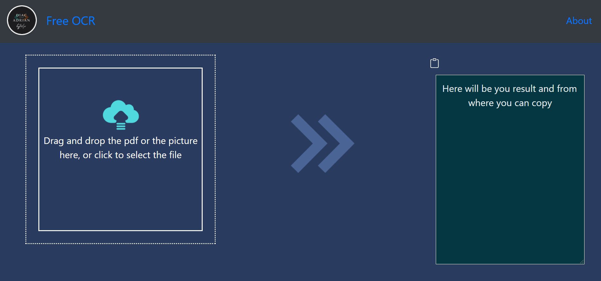

# Free OCR online

Free ocr online is website where you can get the text from your pdf or your photos
and just copy the text

## Tehnologies used
* React for frontend
* NodeJs backend with express library
* Azure Web Services, computer vision


## Installation

Use the package manager [npm](https://www.npmjs.com/) to install the packages.
### For backend

```bash
cd backend
npm install
```
And also where you need to create .env file where you can put your key and endpoint from azure web services for computer vision

### For frontend
```bash
cd ocr
npm install
```
## Usage

```bash
cd ./ocr
npm start
cd ./backend
npm start
```


* Just drag and drop your pdf/photo and press the clipboard button to copy your text
## Contributing
Pull requests are welcome. For major changes, please open an issue first to discuss what you would like to change.

Please make sure to update tests as appropriate.

## License
[MIT](https://choosealicense.com/licenses/mit/)